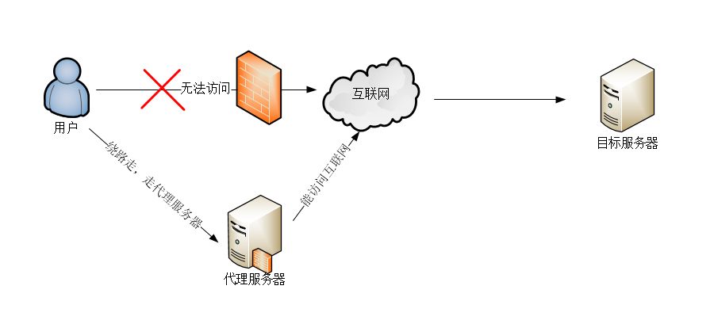
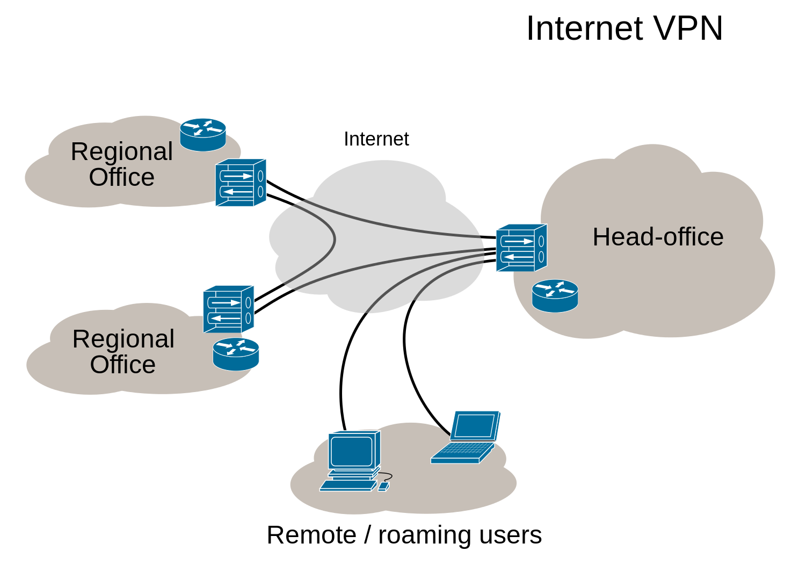

# osx 使用PROXY上网

### 前言
作为一个phper，工作和上网查资料是息息相关的。不过天朝内对外网的限制令大家纠结不已。所以翻墙就成了个必要技能。

从费用的角度上讲，翻墙主要分为两类：免费和付费。相信大多数人和作者一样，对免费这个字眼有着天然好感。所以，作者最早翻墙使用的大名鼎鼎的goagent。

但是好景不长。后期goagent变得很不稳定。给作者带来的痛苦超过了免费带来的快乐。这时候，作者就开始找付费的代理。

根据作者有限的知识，翻墙的方式可以有 proxy 和 vpn 两种。

proxy 是正向代理方式，即先将你的请求发送到代理服务器，再由代理服务器向目的地发起请求。如下图

前面说的goagent便是个proxy。基本原理就是把google engine提供的服务器当做一个正向代理服务器。

而vpn(virtual private network)是另外一种技术。当用户接入到vpn之后，初始的路由表会更改，根据路由表的规则自vpn的出口路由生成请求。这篇文章的目的不是介绍vpn，所以这里不深入说明，只要把它理解成一个普通的局域网就好了。

### 正文
昨天和一个同事聊到怎么翻墙的问题。作者和他说作者正在用某代理服务。然后他说这个代理服务不咋地啊。于是想我推荐了另外个代理服务。因为这个服务是一批人组团买的……无奈作者已经买了一年之前的服务，但是因为他们几人组团，还多出一个名额，作者就要过来试试怎么用。

先说下作者之前使用的服务A。它是个阉割的代理服务。为什么说阉割？因为它只有chrome的插件。其实作者的要求不高，用得最多的是google和一些外国技术论坛。因为只是上网，所以没觉得这服务差到哪儿。但是对于我的同事——有上外服玩游戏的需求，就完全不能满足了。因为作者常常会上github找些东西，pull个几m的仓库用半个小时作者也忍了。但是最近搞docker的时候，发现镜像完全无法下载。

于是，借这次搞了个新的代理，来搞下全局代理配置。

#### step1 配置全局代理

    network => advance => proxies => 选择自己的代理类型

配置好之后，并不是代表所有traffic都是走这个代理的。osx下每个app可以自行选择是否使用全局的proxy。比如safari和chrome，都默认使用了系统的proxy。但是chrome可以通过插件来进行重新定制代理规则。比如 proxy SwitchySharp 这个插件。

而firefox需在在proxy里面设置使用全局的proxy代理。

#### step2 令 terminal 使用到 proxy

作者用的几个浏览器都很容易支持了proxy。但是iterm2和系统自带的terminal这类软件没有默认使用proxy。

对于这类软件，可以直接改变环境变量达到支持proxy的目的。作者使用的是http proxy，所以只需要添加一条环境变量。

    export http_proxy=‘proxy_id:proxy_port’
